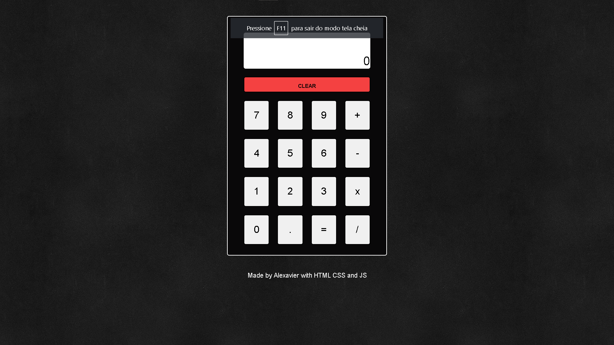

 Calculator in JS

Project made to create a calculator in JS

From The Odin Project's [curriculum](https://www.theodinproject.com/lessons/foundations-calculator).

🔗 **Live preview:** [here](#)

## Built with

### Technologies

* HTML
* CSS
* JS

### Tools

* Visual Studio Code
* Linux terminal (WSL)
* Git and GitHub

## Result

* Used HTML5 **semantic elements** for better readability and structure.
* Used CSS3 **grid** and **flex** to create layout.
* Used **Git** and **GitHub** for project management.

## Summary

### What I learned

* Better knowledge of **Javascript**.
* Improved **code structure** and **code readability**.
* Improved **clean code** writing.

## Author

👤 **AlexavierDev**
* GitHub: [AlexavierDev](https://github.com/alexavierdev)
